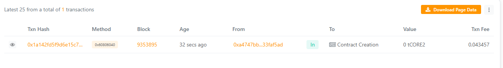

# HyperBlock Labs

## Project Title
HyperBlock Labs

## Project Description
HyperBlock Labs is a decentralized platform built on Ethereum that allows users to register and interact with blockchain-based services seamlessly. This smart contract tracks user registration and total participation in a transparent and secure manner.

## Project Vision
Our vision is to create a user-friendly and decentralized ecosystem where users can interact with blockchain technology without barriers, promoting transparency and innovation.

## Key Features
- Register users on the blockchain
- Verify if a user is registered
- Track total registered users
- Immutable and transparent smart contract operations

## Future Scope
- Integration with ERC20 tokens for rewards
- Multi-chain deployment
- Advanced user analytics and dashboards
- Decentralized voting mechanisms for community governance

## Contract Address

Contract Address - 0xbf404Ac3FC497Ef1655A3b849ADD42B579094640

